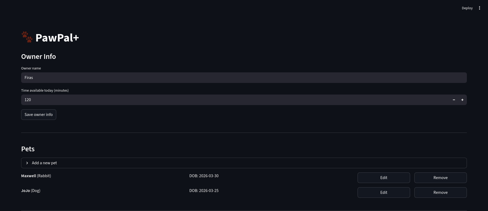

# PawPal+ (Module 2 Project)

You are building **PawPal+**, a Streamlit app that helps a pet owner plan care tasks for their pet.

## Scenario

A busy pet owner needs help staying consistent with pet care. They want an assistant that can:

- Track pet care tasks (walks, feeding, meds, enrichment, grooming, etc.)
- Consider constraints (time available, priority, owner preferences)
- Produce a daily plan and explain why it chose that plan

Your job is to design the system first (UML), then implement the logic in Python, then connect it to the Streamlit UI.

## What you will build

Your final app should:

- Let a user enter basic owner + pet info
- Let a user add/edit tasks (duration + priority at minimum)
- Generate a daily schedule/plan based on constraints and priorities
- Display the plan clearly (and ideally explain the reasoning)
- Include tests for the most important scheduling behaviors

## Getting started

### Setup

```bash
python -m venv venv
source venv/bin/activate  # Windows: venv\Scripts\activate
pip install -r requirements.txt
```


### Smarter Scheduling
Tasks have a start time value that is optional to add. Due dates schedule tasks due today or earlier in the week, if it is recurring, setting as complete will automatically create the next one in the recurrence. Sorting the plans by time will order the plan chronologically with tasks set to no time going last. Tasks can also be filtered by the pet name or if they are completed or not. Conflict detection is also present if two tasks start at the same time.

## Testing PawPal+

### Run the tests

```bash
python -m pytest tests/test_pawpal.py -v
```

### What the tests cover

The suite contains **27 tests** organized across five areas:

| Area | Tests | What is verified |
|---|---|---|
| **Core task & pet operations** | 2 | `check_off()` marks a task completed; `add_task()` increments the pet's task count |
| **Recurring tasks** | 5 | Daily tasks roll over +1 day; weekly tasks roll over +7 days; `"once"` tasks produce no successor; `Pet.complete_task` auto-appends the next occurrence |
| **Schedule generation** | 7 | Highest-priority tasks fill the plan first; tasks that exceed the time budget are skipped; future-dated and already-completed tasks are excluded; a pet with no tasks yields an empty plan |
| **Sorting** | 3 | Tasks sort chronologically by `"HH:MM"`; tasks with no time land at the end; two tasks at the same time both survive in the sorted list |
| **Conflict detection** | 5 | Two pets scheduled at the same slot produce exactly one warning naming both; a single task at a slot is not flagged; tasks with no time are never flagged; three-way collisions still produce one warning |
| **Filtering** | 5 | Results can be narrowed by pet name, completion status, or both; no filters returns all tasks; a pet with no tasks returns an empty result |

### Confidence Level

Confidence: ★★★★☆ (4/5) — rationale: all 27 backend tests pass cleanly across every critical scheduling behavior, but the Streamlit UI and session-state integration in app.py have no test coverage, so full end-to-end reliability is still unverified.

---

### Suggested workflow

1. Read the scenario carefully and identify requirements and edge cases.
2. Draft a UML diagram (classes, attributes, methods, relationships).
3. Convert UML into Python class stubs (no logic yet).
4. Implement scheduling logic in small increments.
5. Add tests to verify key behaviors.
6. Connect your logic to the Streamlit UI in `app.py`.
7. Refine UML so it matches what you actually built.

### Features

Priority-based scheduling — ranks all pending tasks highest-priority-first, then fits them within the owner's available time budget. Lower-priority tasks are dropped when time runs out.

Due-date filtering — The scheduler only considers tasks whose due_date is today or earlier, so future-scheduled tasks are automatically excluded from the day's plan.

Sort by start time — orders the daily plan chronologically using each task's HH:MM start time. Tasks with no time set are placed at the end.

Conflict detection — scans the daily plan for tasks sharing the same start time slot and surfaces a warning for each conflicting time, listing every affected pet and task by name.

Task filtering — Queries all tasks across every pet, with optional filters for a specific pet and/or completion status (pending, completed, or both).

Automatic recurrence — Marks a task complete and returns the next occurrence with an updated due date: +1 day for daily, +7 days for weekly. One-off tasks (once) produce no successor.

Auto-assign open slots — `Scheduler.assign_slots(start_time)` fills in start times for tasks that have none. It walks the daily plan in order, tracking a time cursor. Fixed-time tasks advance the cursor to their end; unscheduled tasks receive the next open slot and consume their duration. The result is a fully timed schedule with no manual clock arithmetic.

Persistent storage — Owner, pet, and task data is serialized to `pawpal_data.json` on every save and reloaded automatically on startup. A legacy `.pkl` file is read as a one-time migration fallback if no JSON file exists yet.

Priority color-coding — Tasks and schedule rows display 🔴 High, 🟡 Medium, and 🟢 Low labels for at-a-glance priority scanning.

### Agent Mode — Challenge 1

The `assign_slots` algorithm was designed with Agent Mode. The prompt described the problem: tasks in the daily plan may have no start time, and a simple sort can't fill those gaps. Agent Mode was asked to reason through a cursor-based approach — advance past fixed-time tasks, fill gaps for unscheduled ones — and translate that into a clean method that mutates `task.time` in place and returns the updated plan. The resulting loop pattern (tracking `cursor` in minutes, branching on whether `task.time` is set) came directly from that generation and was then reviewed and integrated into `Scheduler`.

### Demo


