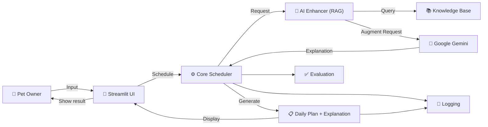

# System Architecture Diagram

```mermaid
flowchart LR
  User["👤 Pet Owner"]
  UI["🐾 Streamlit UI"]
  Scheduler["⚙️ Core Scheduler"]
  AIEnhancer["🤖 AI Enhancer (RAG)"]
  KB["📚 Knowledge Base"]
  Gemini["🧠 Google Gemini"]
  Plan["📋 Daily Plan + Explanation"]
  Logging["📝 Logging"]
  Eval["✅ Evaluation"]

  User -->|Input| UI
  UI -->|Schedule| Scheduler
  Scheduler -->|Request| AIEnhancer
  AIEnhancer -->|Query| KB
  AIEnhancer -->|Augment Request| Gemini
  Gemini -->|Explanation| Scheduler
  Scheduler -->|Generate| Plan
  Plan -->|Display| UI
  UI -->|Show result| User
  Scheduler --> Logging
  Plan --> Logging
  Scheduler --> Eval
```
